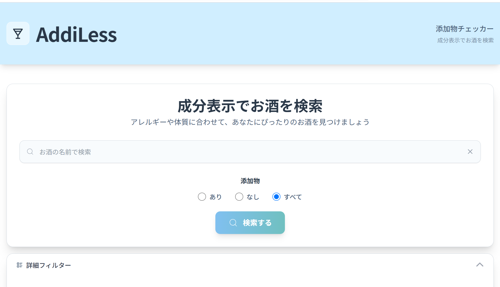
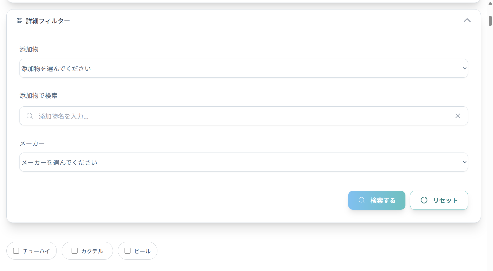

# AddiLess

## 添加物でお酒を検索

お酒の添加物を簡単にチェック、検索できるアプリです。

## 機能概要

- **添加物チェック**：添加物の有無が一目でわかります
- **商品名・添加物有無で検索**：お酒の商品名、添加物有無で検索可能
- **詳細検索**：添加物、添加物名称、主要な飲料メーカーで検索可能
- **詳細情報**：アルコールパーセンテージ、糖質量、カロリー、原材料、おすすめレシピなど紹介
- **レスポンシブ対応**：スマートフォンからＰＣまでどの端末でも利用可能
- **自動データ登録**：バッチコマンド実行で、メーカーサイトから情報を収集、登録

## スクリーンショット




## 使用技術


## 必要環境

- Node.js v20.19.0 以上
- npm

## セットアップ

### 1.リポジトリをクローン

```bash
$ git clone https://github.com/asa129/addiless-alcohol-app
$ cd addiless-alcohol-app
```

### 2.パッケージインストール

```bash
$ npm install
```

### 3.環境変数を設定

必要な API キー

- Supabase
- ClaudeAPI

`.env.example`を`.env`に変更して、以下を設定してください

```bash
VITE_SUPABASE_URL=Supabase Project URL
VITE_SUPABASE_ANON_KEY=Project API Keys anon public
ANTHROPIC_API_KEY=your_claude_api_key
```

### 4.開発サーバー起動

```bash
npm run dev
```

### 5.ブラウザで URL にアクセス

## バッチ実行

以下のコマンドを実行後、puppeteer を使用して、メーカーサイトから情報を収集、
AI がおすすめの飲み方、カクテルレシピ、ペアリング情報を生成して Supabase に自動登録してくれます。
DBプロジェクト作成後、バッチ実行することで100データほど作成可能です。

```bash
$ npx tsx ./batch/autoInsertData.ts
```
